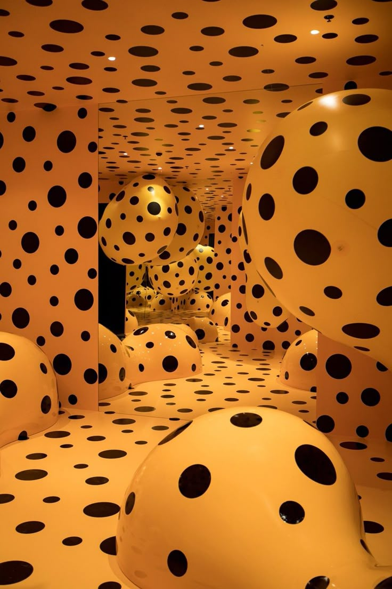
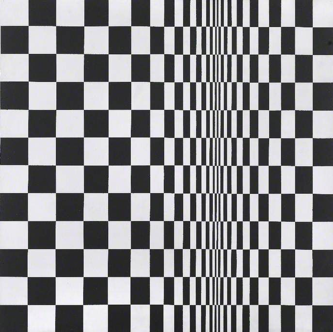

# IDEA-9103-Quiz8
# IDEA 9103 Quiz 9 Wheels of Fortune: A Digital Reimagining

## Part 1: Imaging Technique Inspiration

- *Inspiration*
  1. 
  #### [Retrieved from Pinterest](https://www.pinterest.com/pin/11118330328169357/)
    *Figure 1: Yayoi Kusama's immersive polka dot installation, the repetition and perspective of the dots enhance the sense of movement.*

  2. 
  #### [Retrieved from Pinterest](https://www.pinterest.com/pin/157766793180021138/)
    *Figure 2: Bridget Riley creates a "trembling" effect through the gradient arrangement of black and white squares, inspiring a visual rhythm of rotation.*

- ### **Dynamic polka dot arrangement** 
  Combining Yayoi Kusama's flowing dots with the geometric movement of Op Art: Gradient dots are arranged radially along the spokes of Wheels of Fortune, with the inner circle slowing down (symbolizing stability) and the outer circle accelerating (metaphorically losing control), echoing Abad's exploration of the flow of fate.

- ### **Visual illusion and color contrast**  
  The illusion of rotation is enhanced through high-contrast complementary colors (such as blue and orange) and the density difference of dots, reproducing the cultural restlessness in its collage texture.

## Part 2: Coding Technique Exploration

- *Inspiration*
  - 
  #### [Earth Moon Emoji Orbit](https://happycoding.io/tutorials/p5js/arrays/earth-moon-emoji-orbit)
   *Rotation animation and wave point color change can be achieved through this case.*
- ### **Polar coordinate conversion** 
  Convert Cartesian coordinates (x, y) to polar coordinates (r, θ) to distribute the wave points along the circumference.

- ### **Texture overlay** 
  superimpose translucent noise on the wave point layer (simulating manual rubbing)

- ### **Dynamic color contrast** 
  switch complementary color combinations according to wheel speed

- ### **Dynamic parameters**  
  add angle increments to each wave point (such as angle += speed), and adjust the speed difference in combination with noise functions to achieve "irregular flow".

- ### **Non-uniform rotation**  
  inner circle is slow, outer circle is fast (reflecting the "sense of loss of control")